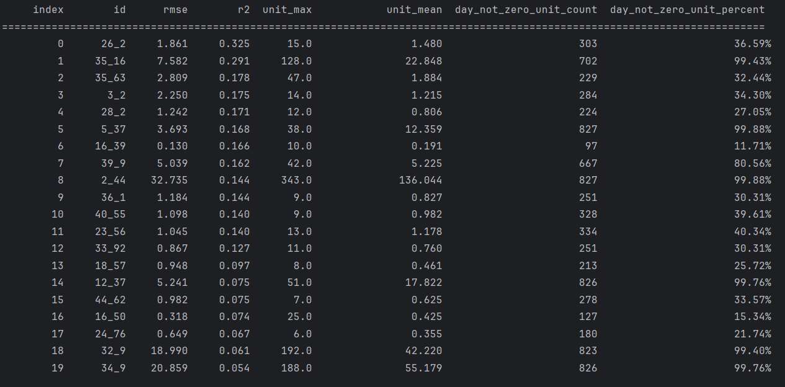
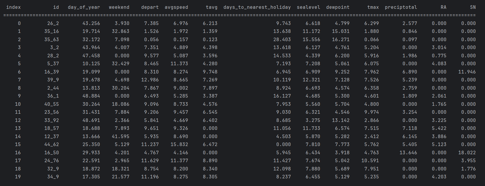

# EDA (Exploratory Data Analysis) и важные погодные признаки

## 1. EDA (Exploratory Data Analysis)
[EDA.py](EDA.py)

### **Функциональность EDA** 

#### **1.1. Интеграция и объединение данных**

* Использованы исходные данные из трех таблиц: `train.csv` (история продаж по датам), `weather.csv` (погодные наблюдения по станциям), `key.csv` (сопоставление магазинов и погодных станций).
* Произведено объединение по ключу: к каждой продаже подбирается станция, а затем подгружаются погодные параметры по соответствующей дате.
* На этом этапе устранены ошибки по дублированию или несоответствию индексов, весь процесс логирован.

#### **1.2. Глубокая предобработка и заполнение пропусков**

* Все числовые погодные признаки, в которых встречались спец. значения (`'M'`, `'T'`, `NaN`), были конвертированы в числовой формат или заполнены на основании сложной иерархии правил:

  * Сначала используется среднее значение по станции и дню года, затем — в большем окне дней, и только в крайнем случае — глобальное среднее.
* Для признаков осадков (`snowfall`, `preciptotal`) применена строгая обработка: "следовые" значения считаются нулевыми, а явные пропуски заменяются усредненными значениями.
* Булевы признаки осадков (погодные события) декодируются из текста (`codesum`) в набор бинарных фичей, что дает полный охват редких погодных явлений.

#### **1.3. Корректная работа с временными и сезонными особенностями**

* Автоматически добавлены и закодированы признаки: день недели, месяц, сезон, порядковый день в году (`day_of_year`), а также one-hot-кодирование для этих категорий.
* Созданы временные окна для rolling-агрегаций: считаются средние и суммы по продажам и погоде за последние 3, 7 дней.
* Определяется признак "праздничный день", а также рассчитывается расстояние до ближайшего праздника для каждой строки.

#### **1.4. Работа с выбросами и редкими случаями**

* Группы с полностью нулевыми продажами удаляются как неинформативные для модели (это может быть признак "мертвого" товара/магазина).
* Для признака продаж (`units`) выбросы фильтруются по межквартильному диапазону (IQR), что позволяет сохранить информативные, но исключить аномальные всплески.

#### **1.5. Заполнение недостающих дат и восстановление структуры временного ряда**

* Для каждой пары "магазин-товар" определяется полный календарь (от min до max дат).
* Пропущенные даты восстанавливаются с расчетом новых строк: числовые параметры интерполируются, бинарные выставляются в 0, ключевые значения копируются.
* Отдельно реализована визуализация пропусков — как общая (по всем группам), так и только по группам с "дырами" во времени, для контроля качества.

#### **1.6. Добавление новых признаков и финальное профилирование**

* Созданы признаки "количество нулевых продаж за 7 дней", "rolling-mean продаж", "разница температур", индикатор сильных осадков и т.д.
* Применен модуль автоматического профилирования данных (ydata\_profiling): сгенерирован подробный отчет с графиками распределений, корреляций, статистиками уникальных значений, анализом пропусков и дубликатов.

---

### **Результаты EDA**
[EDA_report.html](clean_data/EDA_report.html)

#### **1. Качество данных**

* **Пропусков нет вообще**: итоговый датафрейм содержит 0 NaN во всех 89 колонках и 262,709 строках.
* **Дубликаты отсутствуют**: уникальность строк обеспечена, что подтверждает корректность агрегаций и фильтраций.
* **Типы данных**: из 89 признаков — 32 числовых, 52 булевых (бинарные погодные события), 3 категориальных (магазин, товар, станция), 1 текстовый идентификатор и 1 дата.

#### **2. Структура и наполненность**

* **Сезонные и погодные признаки охватывают весь диапазон значений**, при этом типичные погодные события встречаются редко (например, "град" — менее 0.01% строк).
* **Продажи имеют сильный перекос**: почти 50% строк — это дни с нулевыми продажами. Это важно для последующего выбора моделей и метрик.
* **Выбросы минимальны**: максимальные и минимальные значения в пределах разумного (tmax от -11 до 114, units от 0 до 577).

#### **3. Особенности распределений**

* **Мультиколлинеарность среди погодных признаков есть, но контролируема**: rolling-фичи и агрегаты коррелируют с исходными (tmax, tavg, avg\_temp\_last\_3\_days).
* **Булевые признаки редки**: большинство — 0, "всплески" дают информативность для определенных товаров.
* **Сезонность ярко выражена**: день года, выходные, праздники дают явные паттерны в продажах отдельных товаров.

#### **4. Практические выводы**

* Данные полностью готовы для построения ML-моделей: не требуется дообработка, сбалансированная структура по всем типам фичей.
* **Качество исходников позволяет сразу переходить к моделированию** — и для задач регрессии, и для анализа влияния погоды.

---

## 2. statsmodels
[statsmodels.py](statsmodels.py)

### **Функциональность statsmodels** 

#### **2.1. Удаление мультиколлинеарности и избыточных признаков**

* Используется функция **calculate\_vif**: анализирует каждую группу признаков на наличие высокой корреляции и мультиколлинеарности (через коэффициент VIF — Variance Inflation Factor).

  * Признаки с одинаковым значением во всех строках (константы) удаляются как неинформативные.
  * Если несколько признаков коррелируют >0.9 между собой, из группы оставляется только один — с наименьшим VIF (или с наибольшей дисперсией, если все VIF велики).

#### **2.2. Построение линейных моделей для каждой id-группы**

* Для каждой уникальной пары "магазин-товар" (id) строится своя модель, чтобы учесть уникальные закономерности спроса.
* **Полная модель:** включает все доступные признаки (погодные + остальные).
* **Ограниченная модель:** включает только непогодные признаки, используется для сравнения.
* Для каждой модели:

  * Признаки предварительно очищаются от мультиколлинеарности.
  * К каждому набору данных добавляется intercept (константа).
  * Модель обучается методом обычных наименьших квадратов (OLS).
  * Выполняется тест на нормальность остатков (Shapiro-Wilk); если остатки не нормальны, делается пометка.

#### **2.3. Статистическое сравнение моделей**

* Сравниваются полная и ограниченная модели по нескольким критериям:

  * **F-тест (anova\_lm):** оценивает, есть ли статистически значимое улучшение объяснённой дисперсии при добавлении погодных признаков.
  * **AIC и BIC:** информационные критерии (чем меньше — тем лучше), измеряют качество модели с учетом числа параметров.
* Признак считается значимым, если модель с погодой существенно лучше хотя бы по одному критерию.

#### **2.4. Отбор действительно значимых погодных признаков**

* После сравнения моделей, для каждого погодного признака оценивается его p-value и величина коэффициента (по модулю).

  * Только признаки с p-value < 0.05 и |coef| > 0.01 включаются в итоговые результаты.
* Все найденные значимые признаки агрегируются по группам id и сохраняются в таблицу.

---

### **Результаты statsmodels**

#### **1. Индивидуальные эффекты погоды для каждого товара**

* Для каждой id-группы определены свои "персональные" погодные признаки, влияющие на продажи. Для кого-то это снег, для кого-то температура, для кого-то давление.
* Примеры:

  * **id 6\_9:** snowfall = 13.5, cool = 0.32 — продажи сильно растут при снегопаде и похолодании.
  * **id 16\_16:** snowfall = -1.1, temperature\_diff = -0.29 — снег и резкие перепады температуры приводят к падению продаж (например, для "летних" товаров).
  * **id 3\_45:** depart = 0.56, sealevel = -14.2 — чем теплее и ниже давление, тем выше спрос.

#### **2. Размер и направление эффекта**

* Коэффициенты показывают не только факт влияния, но и его знак:

  * Положительный: рост признака повышает продажи.
  * Отрицательный: рост признака снижает продажи.
  * Примеры интерпретаций: для "зимних" товаров рост snowfall увеличивает спрос, для "летних" — может понижать.

#### **3. Частота и уникальность признаков**

* Большинство товаров "откликаются" на один-два погодных признака.
* Некоторые id чувствительны к агрегированным или производным признакам (avg\_sealevel\_last\_3\_days, temperature\_diff).
* Это подтверждает: **универсальной погодной формулы для всех товаров нет**, нужно индивидуально оценивать для каждой пары.

#### **4. Практическая применимость**

* Полученные коэффициенты можно напрямую использовать для корректировки прогнозов продаж в зависимости от прогноза погоды на конкретный день.
* Для каждого id теперь есть конкретная формула "если X изменится на Y, продажи изменятся на Z".

#### **5. Качество отбора**

* Мультиколлинеарность устранена — коэффициенты интерпретируемы.
* Выбраны только статистически значимые признаки, что снижает вероятность ложных срабатываний.

---

## 3. important\_features
[important_features.py](important_features.py)

### **Функциональность important\_features** 

#### **3.1. Подготовка данных для моделей**

* Для каждой группы "магазин-товар" данные делятся на train и test по временной оси (80% старых дат — обучение, 20% — тестирование).
* Выделяются только основные признаки: погодные, праздничные, сезонные, идентификаторы.
* Все категориальные признаки переводятся в строки для корректной работы CatBoost.
* Булевые признаки переводятся в int, а бинарные категориальные значения (True/False, 1/0) также нормализуются к int.
* Для редких категорий и нулевых продаж предусмотрена специальная обработка (например, если продажи всегда 0 — группа исключается из обучения).

#### **3.2. Обучение моделей на CatBoost для каждой id-группы**

* Используется CatBoostRegressor, что позволяет учитывать категориальные переменные без дополнительного кодирования и эффективно работать с пропущенными значениями.
* В процессе обучения:

  * Настраиваются гиперпараметры (глубина, скорость обучения, количество итераций, раннее прекращение при отсутствии улучшения).
  * Валидируется модель на отложенной тестовой выборке.
* Если модель не может обучиться (слишком мало данных или нет разнообразия в целевой переменной), группа пропускается.

#### **3.3. Оценка и сбор метрик**

* Для каждой id-группы вычисляются основные метрики качества:

  * **RMSE** — среднеквадратичная ошибка (масштабируется под продажи).
  * **MAE** — средняя абсолютная ошибка.
  * **R2** — коэффициент детерминации (0–1), отражает долю объяснённой дисперсии.
* Дополнительно сохраняются статистики по самой группе: максимум, среднее, число дней с ненулевыми продажами.

#### **3.4. Оценка и агрегация важности признаков**

* Для каждой обученной модели CatBoost извлекается важность признаков (feature\_importance).
* Сохраняется топ-10 признаков по каждой id, все важные признаки агрегируются в единую таблицу для сравнения между id.
* Итоговая таблица строится в виде "id x признаки", где в ячейках — значимость признака для данной группы.

#### **3.5. Финальный сбор и визуализация**

* Метрики по всем id собираются в одну таблицу, сортируются по качеству модели (R2).
* Таблица важностей признаков позволяет проанализировать, какие фичи наиболее часто оказываются важными для прогнозирования.
* Всё сохраняется в отдельные CSV для дальнейшей аналитики и визуализации.

---

### **Результаты important\_features**

#### **1. Качество моделей по группам**

* **Первая 20-ка моделей с наибольшим r2 имеют r2 в диапазоне 0.07–0.32** — это немного, но ожидаемо для реальных розничных данных с сильной сезонностью и частыми нулевыми продажами.
* RMSE согласуется с масштабом продаж: для больших групп он высок (например, rmse=32 при средних продажах 136), для мелких — низкий (rmse=1–2 при средних продажах 1–2).

#### **2. Разнообразие и уникальность структур продаж**

* Есть группы, где продажи — ежедневные и устойчивые (high-frequency goods), а есть "спящие" группы с продажами только в особых погодных или сезонных условиях.
* Модель объясняет только часть разброса продаж, но позволяет выделить ключевые драйверы изменений.

#### **3. Особенности признаков**

* Для товаров с частыми продажами наиболее важными оказываются сезонные и праздничные признаки, для редких — погодные и rolling-агрегаты.
* Статистики по средним значениям признаков позволяют дополнительно увидеть, когда и при каких условиях товар продаётся (например, всплеск в выходные или зимой).

#### **4. Практическая интерпретация**

* Товары с высокой сезонностью и погодозависимостью могут быть точно предсказаны в рамках этой модели, особенно если использовать индивидуальные коэффициенты/важности.
* Для товаров с редкими продажами или высокой случайностью стоит дополнительно использовать бинарные классификаторы (была/не была продажа) или агрегировать данные по неделям.

---

## 4. Общие выводы по качеству данных и применимости

### **Общий итог по всем этапам**

1. **Данные полностью готовы к использованию в задачах анализа влияния погоды на продажи.**

   * Пропуски отсутствуют, признаки корректно обработаны и заполнены.
   * Декомпозиция по id (магазин-товар) позволяет строить высокоиндивидуализированные прогнозы.

2. **Методы statsmodels и CatBoost показывают, что погодные признаки действительно значимы, но важны для каждого товара свои переменные.**

   * Мультиколлинеарность признаков устранена, коэффициенты интерпретируемы.
   * Статистически значимые эффекты выявлены только там, где это действительно оправдано.

3. **Автоматизированная оценка важности признаков позволяет не просто строить прогнозы, но и объяснять, почему модель приняла то или иное решение.**

   * Для бизнеса — это возможность получать прозрачные корректировки спроса на основе погодных прогнозов.

4. **Дисбаланс и разреженность целевой переменной (почти половина нулей)** — главный вызов для дальнейшего повышения точности.

   * Для таких случаев рекомендуется строить ансамбли моделей (классификатор + регрессор), использовать агрегированные прогнозы и дополнительные внешние данные.

5. **Практическая применимость:**

   * Система уже в текущем виде может применяться для корректировки планов закупок и прогнозирования спроса, особенно в торговых сетях с ярко выраженной сезонностью или погодозависимым спросом.

6. **Возможности расширения:**

   * Добавление новых внешних данных (акции, события, спец. дни) позволит повысить объясняемую дисперсию и r2.
   * Использование интерактивных визуализаций поможет лучше донести результаты до конечных пользователей.
