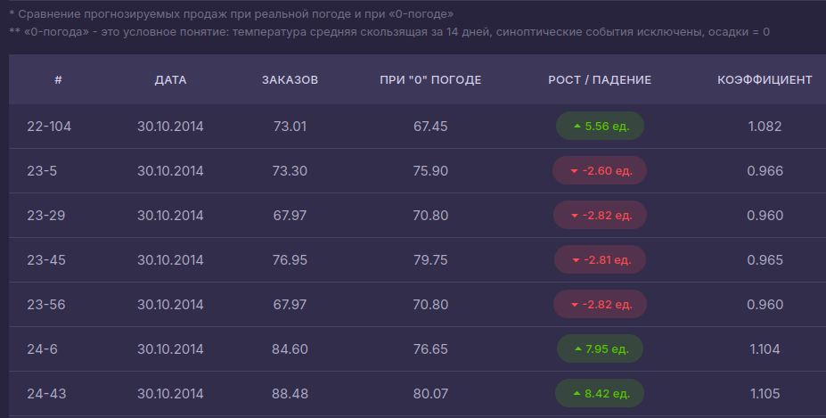

# MFTI_Hackathon_Walmart

## Задача:

`Оценить влияние погодных условий (температуры воздуха, осадков) на продажи товаров в конкретных локациях`.

Для этого для каждого товара, на каждую дату/период нужно вычислить коэффициент отношения объёма продаж при данной погоде к объёму продаж, который необусловлен погодными факторами.

Так же требуется наглядно визуализировать погодное влияние на продажи.

## Гипотезы

Мы рассматриваем две основные гипотезы:

1. Обучить одну модель на данных, включающих предоставленную погоду. Потом делать по два предсказания: с данной погодой и "очищенной". Их отношение покажет нам требуемый коэффициент влияния погоды на продажи.
Под "очищенной погодой" подразумевается усреднённая температура, влажность, ветер, исключение осадков и всех других погодных явлений.

2. Обучить две модели. Одну с включением погодных параметров, а вторую без них, использовать только статистические данных о продажах товара. Далее делаем два предсказания, по одному каждой моделью. Как предполагается соотношение предсказаний будет как минимум пропорционально степени влияния погоды на продажи.

---

## Веб-приложение

Мы разрабатываем веб-сервис для наглядной визуализации результатов: http://46.173.214.94:8090/

---

## Очистка данных:

- Удалили товары которые ни разу не продавались
- Заменили пропуски (M/T) средними значениями и конвертировали типы данных
- One-hot кодирование погодных кодов или выделение их в отдельный признак
- Товарам установлен категориальный идентификатор. Считаем что в разных магазинах товар всегда разный, так как не можем однозначно сказать что он одинаковый.
- Данные объеденины в датасет: магазин + товар + погодные данные + целевая переменная units.

## Текущие результаты проверки гипотез:

1. [Обучена модель CatBoost](research/AlexZyryanov) train/valid/test: 75%/12.5%/12.5%.
Результат RMSLE on test = 0.5314.
Делает два предсказания: с предоставленной погодой и с "очищенной".
Модель использовалась для прогнозирования данных, которые сейчас представлены на сайте.
Видно, что над самими предсказаниями продаж ещё стоит работать.
Но вот их соотношение и разница выглядят вполне правдоподобными.

2. [Обучаем LSTM модель на 3 периода](research/Forecast) - неделю, месяц, сезон. Подход: одна модель / два предсказания с данной погодой и "очищенной".
Ведётся работа над максимизацией характеристик модели.

3. [Обучение двух моделей градиентного бустинга LightGBM](research/AndreyKotelnikov) (LGBMRegressor).
Одна обучалась с погодными признаками, другая без.
Определены коэффициенты в stats_coef/stats, которые отражают рост или падение продаж.
Построен график сравнения базового и погодно-скорректированного сценариев.

4. [Обучение двух моделей CatBoost](research/KaterinaK).
Одна обучалась на всех представленных данных, другая с исключением признаков "температура", "осадки".
Идёт работа над улучшением показателей полученных моделей, формированием новых признаков.

5. [Обучены три модели](research/MarinaSemushina) (80% train, 20% test):
XGBoost RMSE: 0.3355
Random Forest RMSE: 0.3061
Линейная регрессия RMSE: 0.8901
Идёт работа над применением одной из моделей для вычисления искомого коэффициента влияния погоды на продажи.
