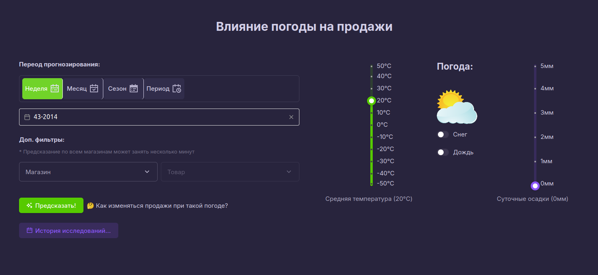
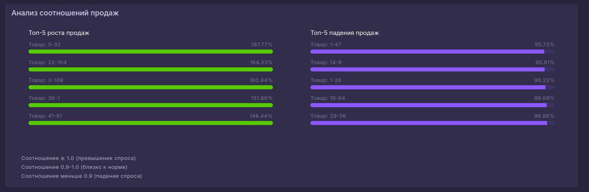
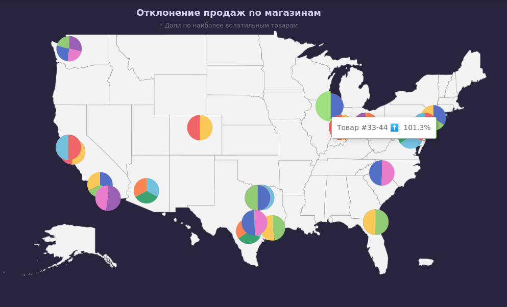
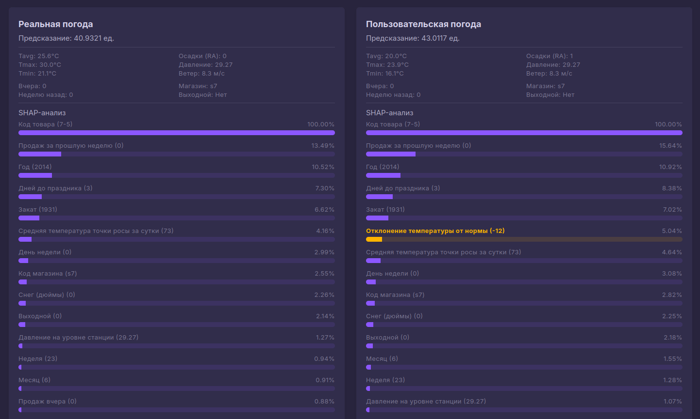
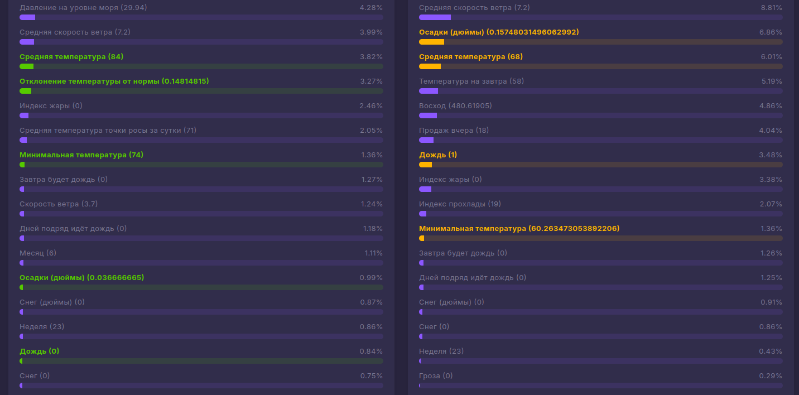

# Приложение для оценки вляния погоды на продажи

Приложение построено по принципу проведения отдельных исследований с заданными параметрами.

На первой странице вы можете выбрать период анализа: неделю, месяц, сезон или произвольный диапазон дат.
Затем задаются интересующие погодные параметры: средняя температура (в °C), количество осадков (в мм), а также опциональные флаги "Дождь" и "Снег".
Дополнительно можно выбрать конкретный магазин или товар.




## Где посмотреть?

Развернули на виртуальном сервере: http://46.173.214.94:8090/


## Как это работает.

Для заданных погодных условий система подменяет фактические значения погоды в выборке и повторно производит предсказание при помощи ML-модели — для всех записей формата "магазин-товар-дата", подпадающих под условия.

Ранее для всех записей были сделаны предсказания той же моделью на основе реальной погоды.
Ожидается, что эти предсказания близки к фактическим продажам (полю units), однако это не всегда возможно — например, некоторые даты и товары могли отсутствовать в обучающем наборе.

Система сравнивает прогнозы продаж на основе заданной погоды с прогнозами на основе реальной погоды, делит одно на другое и получает коэффициент влияния.

Коэффициенты рассчитываются:

  - для каждого товара на каждый день,

  - и для каждого товара за выбранный период (среднее значение).


Результаты отображаются на графиках:

  - топ роста и падения продаж,

  - круговые диаграммы с распределением по магазинам на карте.






## Детальный анализ

Можно рассмотреть отдельное предсказание детально:

  - какие значения передавались модели (до и после подмены),

  - какие получены результаты,

  - насколько значимым оказался каждый параметр (на основе SHAP-анализа).





## Использованные технологии:

Клиентская часть: Vue.js, Vuetify, Apex Charts.
Серверная часть: Django, DRF, Postgresql, Pandas, Numpy, CatBoost.


## Запуск клиентской части:

### Project Setup

```sh
npm install
```

### Compile and Hot-Reload for Development

```sh
npm run dev
```

### Type-Check, Compile and Minify for Production

```sh
npm run build
```
