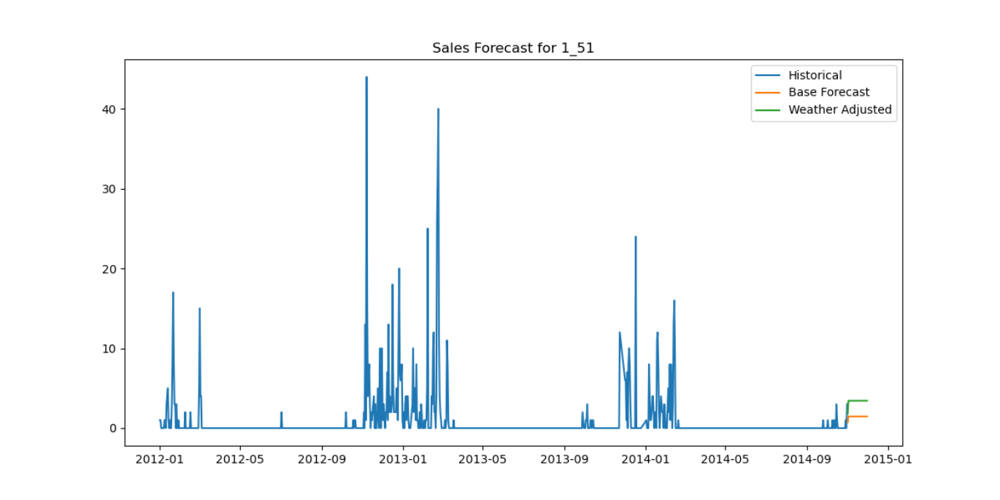

# Weather Impact on Sales Prediction

Проект анализирует влияние погодных условий на продажи товаров в различных локациях.  
Система рассчитывает коэффициенты, корректирующие прогноз спроса на основе метеоданных.

## Структура проекта

```
├── EDA/               # Анализ и подготовка данных
│   ├── EDA.py         # Основной скрипт EDA
│   └── data/          # Исходные и обработанные данные
├── prediction/        # Прогнозирование продаж
│   ├── model.py       # Модель машинного обучения
│   └── stats/         # Коэффициенты из stats_coef
└── stats_coef/        # Стат. анализ коэффициентов
    ├── stats.py       # Расчёт значимых факторов
    └── data/          # Промежуточные данные
```

## Порядок выполнения

1. `EDA/EDA.py` → 2. `stats_coef/stats.py` → 3. `prediction/model.py`

### 1. EDA.py - Предварительный анализ и подготовка данных

#### Основные этапы:

1. **Загрузка и объединение данных**
   - `load_data()`: Объединяет данные о продажах, погоде и ключах магазинов
   - Сохраняет результат в `merged_data.csv`

2. **Предобработка данных**
   - `convert_numeric_columns()`: Замена спецсимволов (M/T) и конвертация типов
   - `fill_weather_nan()`: Интерполяция пропусков в погодных данных
   - `encode_codesum()`: One-hot кодирование погодных кодов

3. **Генерация признаков**
   - `add_time_features()`: Дни недели, месяцы, сезоны
   - `add_weather_features()`: Перепады температур, интенсивность осадков
   - `add_rolling_weather_features()`: Скользящие средние за 3 дня

4. **Очистка данных**
   - `remove_units_outliers()`: Удаление экстремальных значений продаж
   - `remove_zero_sales()`: Фильтрация нулевых продаж

5. **Сохранение результатов**
   - Генерация отчетов `ydata_profiling` в HTML
   - Экспорт очищенных данных в `data_clean.csv`

### 2. stats.py - Статистический анализ коэффициентов

#### Ключевые функции:

1. **Обработка мультиколлинеарности**
   - `calculate_vif()`: Удаляет высококоррелированные признаки (VIF > 10)
   - Исключает дублирующиеся погодные параметры

2. **Построение моделей**
   - OLS-регрессия с учетом погодных факторов
   - Сравнение полной и ограниченной моделей (F-тест, AIC/BIC)

3. **Отбор значимых признаков**
   - Проверка p-value < 0.05 с поправкой Bonferroni
   - Сохранение коэффициентов с эффектом >1%

4. **Результаты**
   - `weather_significant_features.csv` - значимые факторы для каждого товар-магазина
   - Текстовый отчет с детализацией коэффициентов

### 3. model.py - Прогнозирование продаж

#### Рабочий процесс:

1. **Подготовка данных**
   - `load_and_prepare_data()`: Загрузка данных для конкретного товар-магазина
   - Создание лаговых признаков продаж (7 дней)

2. **Обучение моделей**
   - Базовая модель: только временные признаки и история продаж
   - Продвинутая модель: с учетом значимых погодных факторов
   - Валидация на 3 фолдах с TimeSeriesSplit

3. **Генерация прогнозов**
   - Рекуррентное предсказание на 30 дней вперед
   - Автоматическое обновление лаговых признаков

4. **Визуализация**
   - График исторических данных и двух вариантов прогноза
   - Сравнение MAE моделей с погодными коэффициентами и без

График с прогнозом


## Требования

- Python 3.12
- Зависимости: `pandas`, `numpy`, `statsmodels`, `lightgbm`, `ydata-profiling`

## Интерпретация результатов

- **Коэффициенты в stats_coef/stats**: Положительные значения увеличивают прогноз продаж, отрицательные - уменьшают
- **Графики прогнозов**: Сравнение базового и погодно-скорректированного сценариев
- **Метрика MAE**: Средняя абсолютная ошибка прогноза (в единицах товара)

